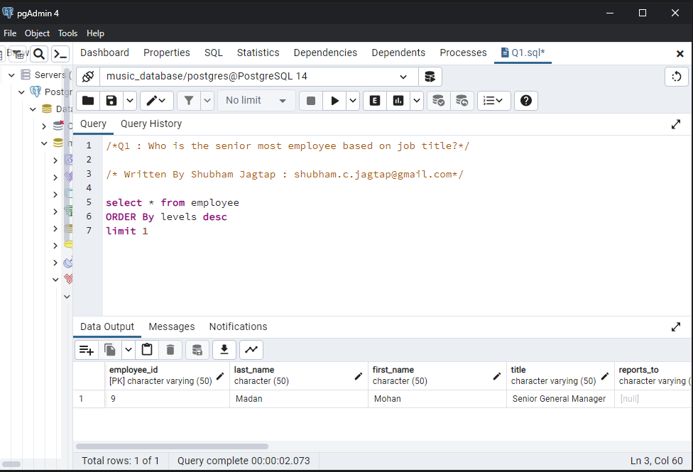

# SQL Project Music Dataset Analysis

1. Who is the senior most employee based on job title?
   
2. Which countries have the most Invoices?
   ``
3. What are top 3 values of total invoice?
   ``
4. Which city has the best customers? We would like to throw a promotional Music
   Festival in the city we made the most money. Write a query that returns one city that
   has the highest sum of invoice totals. Return both the city name & sum of all invoice
   totals.
   ``
5. Who is the best customer? The customer who has spent the most money will be
   declared the best customer. Write a query that returns the person who has spent the
   most money.
   ``
6. Write query to return the email, first name, last name, & Genre of all Rock Music
   listeners. Return your list ordered alphabetically by email starting with A
   ``
7. Let's invite the artists who have written the most rock music in our dataset. Write a
   query that returns the Artist name and total track count of the top 10 rock bands
   ``
8. Return all the track names that have a song length longer than the average song length.
   Return the Name and Milliseconds for each track. Order by the song length with the
   longest songs listed first
   ``
9. Find how much amount spent by each customer on artists? Write a query to return
   customer name, artist name and total spent
   ``
10. We want to find out the most popular music Genre for each country. We determine the
    most popular genre as the genre with the highest amount of purchases. Write a query
    that returns each country along with the top Genre. For countries where the maximum
    number of purchases is shared return all Genres
    ``
11. Write a query that determines the customer that has spent the most on music for each
    country. Write a query that returns the country along with the top customer and how
    much they spent. For countries where the top amount spent is shared, provide all
    customers who spent this amount
    ``
